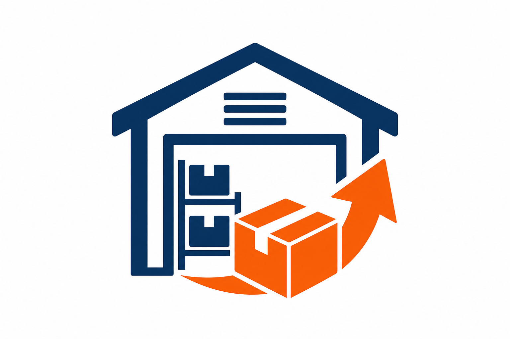

# AWRS — Automated Warehouse Restock System

**Group 4** | CS 4398 Software Engineering | TXState

A full-stack warehouse inventory management application with automated restocking, role-based access control, audit logging, and a modern web dashboard.



## Features

| Feature | Description |
|---------|-------------|
| **Authentication** | Login/logout with Admin, Manager, Worker roles |
| **Item Catalog** | SKU management with min/reorder thresholds |
| **Locations** | Hierarchical warehouse locations (aisle → shelf → bin) |
| **Receive Shipments** | Increase inventory at a location + audit log |
| **Fulfill Orders** | Deduct inventory with stock validation |
| **Adjustments** | Manual corrections (Manager/Admin only) |
| **Restock Engine** | Auto-detect low stock, generate prioritized tasks |
| **Dashboard** | Real-time alerts, urgent tasks, activity feed |
| **Audit Trail** | Full transaction history |
| **Reports** | Stock movement and inventory analytics |
| **User Management** | Admin CRUD for user accounts |

## Tech Stack

- **Java 17** + **Spring Boot 3.2** (REST API)
- **HTML/CSS/JS** web frontend (served from Spring Boot)
- **JUnit 5** + **Mockito** for unit tests
- **Maven** build

## Quick Start

### Desktop app (recommended — pops up as a window, NO browser)

**VS Code:** Press **F5** → choose **"AWRS Desktop App"**

**Or run in terminal:**

```powershell
.\run-desktop.ps1
```

Or double-click **`run-desktop.bat`**

Or:

```bash
mvn javafx:run
```

Login with `admin` / `admin123`. The app window opens directly — no website needed.

---

### Web version (optional — opens in browser)

```powershell
.\run.ps1
```

Open **http://localhost:8080** (use `http` NOT `https`)

## Demo Accounts

| Role | Username | Password |
|------|----------|----------|
| Admin | `admin` | `admin123` |
| Manager | `manager` | `manager123` |
| Worker | `worker` | `worker123` |

## Run Tests

```bash
mvn test
```

## API Endpoints

| Method | Endpoint | Description |
|--------|----------|-------------|
| POST | `/api/auth/login` | Authenticate |
| POST | `/api/auth/logout` | Sign out |
| GET | `/api/dashboard` | Dashboard summary |
| GET/POST | `/api/items` | Item catalog |
| GET/POST | `/api/locations` | Warehouse locations |
| GET/POST | `/api/inventory/*` | Receive, fulfill, adjust |
| GET | `/api/inventory/audit-logs` | Audit trail |
| GET/POST | `/api/restock/*` | Restock task engine |
| GET/POST/DELETE | `/api/users` | User management (Admin) |

All endpoints (except login) require `Authorization: Bearer <token>` header.

## Project Structure

```
src/main/java/com/awrs/
  model/          # Domain entities
  repository/     # In-memory persistence
  service/        # Business logic
  api/controller/ # REST controllers
  api/dto/        # Request/response DTOs
src/main/resources/static/
  index.html      # Web app UI
  css/app.css     # Styles
  js/             # Frontend logic
  images/logo.png # App logo
src/test/java/    # Unit & integration tests
```

## Extra Credit Documentation

See `docs/extra-credit/` for Cursor IDE assignment report sections.
